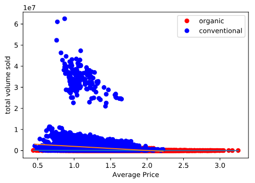

# Avocados #
This analysis of avocado sales was conducted for the UVA Summer Course CS 5010 in collaboration with teammates Rice Tyler, Ada Zhu, and Sudeepti Surapaneni. 
## Main Question ##
Can we use information about avocado sales to choose the optimal scenario to sell a specific amount of avocados?
## Data Cleaning ##
Before beginning analysis, we had to clean up the data. Different rows reported their location to varying levels of specificity. Some would report the city, some the state, and some the entire region of the US. After looking at the data more carefully and perfoming sums, we saw that the state and region rows included all of the rows categorized under their areas, meaning we had to remove these specific rows. Instead of removing this information entirely, we chose to add a column to our data to represent which region each row was in as well as which state so that we could analyze the data on a per-state and per-region basis.

## Data Analysis ##
Before trying to answer for our final question, we wanted to see what simple metrics we could get out of the data. We first looked at the price of avocados across the year, comparing organic to conventional avocados.
```{python}
# looking at price across the year
plt.plot(
    avocados.month[(avocados.type == "conventional")&(avocados.combined==0)]-.25, 
    avocados['AveragePrice'][(avocados.type == "conventional")&(avocados.combined==0)],
    "ro")
plt.plot(
    avocados.month[(avocados.type == "organic")&(avocados.combined==0)]+0.25, 
    avocados['AveragePrice'][(avocados.type == "organic")&(avocados.combined==0)],
    "bo")
```

From this we were able to see that avocado prices followed a sinusoidal curve, with prices increasing in months 3-4 and 8-10. After doing a bit of research, we found that this was likely due to the 
___
Next we set our sights on comparing total volume sold to average price. 
```
# looking at total volume sold vs the avg price
x1 = avocados['AveragePrice'][(avocados.type == "organic")]
y1 = avocados['Total Volume'][(avocados.type == "organic")]
plt.plot(x1, y1, "ro")

x2 = avocados['AveragePrice'][(avocados.type == "conventional")]
y2 = avocados['Total Volume'][(avocados.type == "conventional")]
plt.plot(x2, y2, "bo")
```

It looks like our organic avocado data is following two different distributions. After looking at the general location where most of our data was coming from, we decided to limit our further analysis to California specifically to remedy this issue.  We quickly found that the relationship here was non-linear.


Our intuition about the data made us consider applying a log-log transform to the data. Once we had done this, we found that our variables had a linear relationship.


Going back to our original question, we sought to build a model using more than just these parameters. Our other inputs were categorical so we did not worry about transforming them before adding them to our regression model.
```
result, predictors = dmatrices(
    "np.log(Q('Total Volume')) ~ np.log(AveragePrice) + region + type + Date + np.log(AveragePrice):type + np.log(AveragePrice):region", avocados)
avocMod3 = sm.OLS(result, predictors).fit()
```
At this point in our data science education (less than a full month in), we had gotten used to the R method for representing formulae. As a result, we found a Python package called 'Patsy' that allowed us to represent our formula in the same way. We chose to include interaction terms between the log of average price and the type of avocado as we saw in our graphs that the type caused distinct differences. We also chose to include an interaction term between the log of the average price and the region since our earlier analyses had shown that specific regions price avocados much higher than others, likely due to differences in cost of living.
## Conclusions ##
After forming our model, we looked at the coefficients for valuable insights. Some of them confirmed our intuition and prior analysis of the data and some were new:

- California has a much higher coefficient than other states.
- Organic avocados have a negative coefficient.
- Increasing the average price of the avocados negatively affects the total volume that will be sold.
- The date of the sale followed the sinusoidal function that we saw earlier, but it is also increasing in size over the years.
- Some interactions between price and region are positive and some are negative, implying that increasing the price in certain regions might actually increase the volume of sales.
